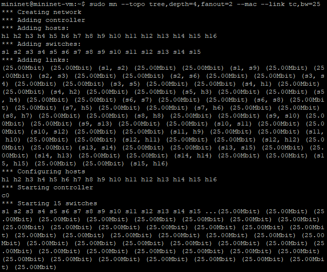
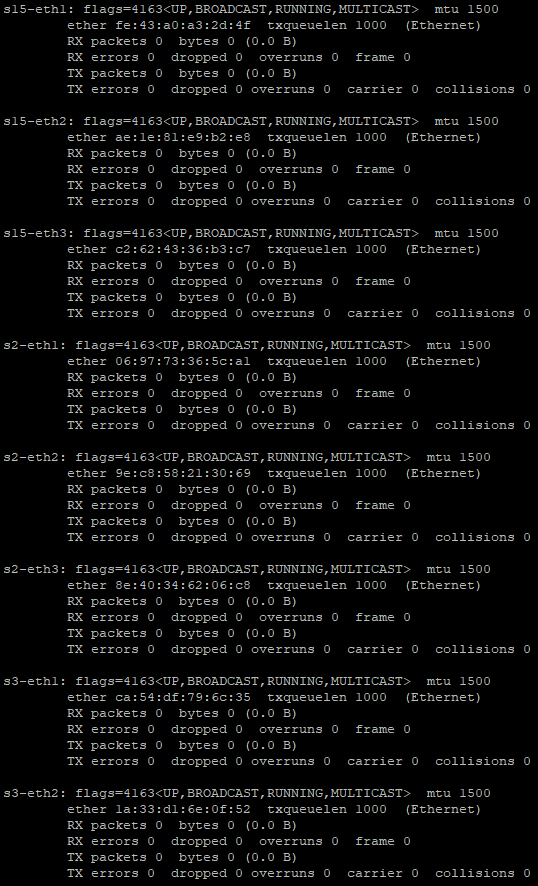
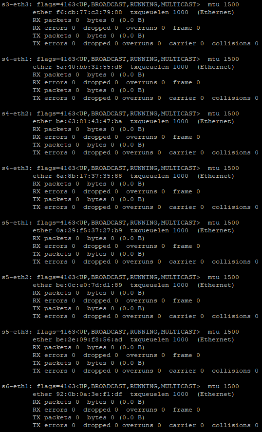
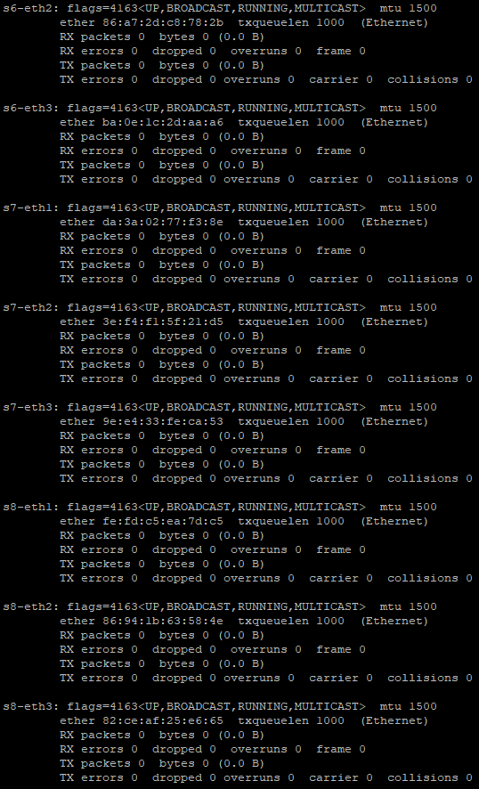

# C115 - Trabalho de Aprendizado com Mininet
Este repositório contém o trabalho prático desenvolvido na disciplina C115 com foco em simulação de redes utilizando o Mininet. O objetivo é realizar testes de desempenho, largura de banda e conectividade em diferentes topologias de rede.

## Objetivo
O trabalho explora a criação e o teste de topologias de rede no Mininet, configurando hosts e switches para realizar testes de largura de banda e conectividade TCP usando ferramentas como iperf. O objetivo é aplicar conceitos de redes de computadores na prática.

## Topologia Utilizada
A topologia utilizada foi uma topologia em árvore com os seguintes parâmetros:

+ Profundidade: 4
+ Fanout: 2 (cada nó se ramifica em 2 nós filhos)
+ Largura de banda: 25 Mbps
+ Endereços MAC padronizados para os hosts e switches

### Comando para criação da topologia:
```
sudo mn --topo tree,depth=4,fanout=2 --mac --link=tc,bw=25
```
#### Saída obtida:


## Inspecionando Interfaces, Endereços MAC, IP e Portas
Após a criação da topologia, foi possível inspecionar as interfaces de rede, endereços MAC e IP dos hosts e switches, utilizando os seguintes comandos:

### 1. Listar todos os nós:


### 2. Exibir interfaces de rede do host h1:


### 3. Exibir informações das interfaces do switch s1:







### 4. Verificar as portas e mapeamentos dos hosts e switches:


## Testes Realizados
Foram realizados os seguintes testes:

### Teste de Ping
Para verificar a conectividade entre diferentes nós na topologia, foram realizados testes de ping entre os hosts:

#### h1 e h2:


#### h1 e h3:


#### h2 e h3:


#### pingall:


### Teste de Largura de Banda com Iperf
Os testes de largura de banda TCP foram realizados entre o host 1 (servidor) e o host 2 (cliente) usando a ferramenta iperf.

#### Servidor TCP no host 1 (porta 5555):


#### Cliente TCP no host 2, enviando dados por 10 segundos, com relatórios a cada 1 segundo e largura de banda de 25 Mbps:


Para uma visualização clara dos resultados de desempenho, foi gerado um gráfico utilizando o Gnuplot, que exibe o throughput (largura de banda) em Mbps a cada segundo durante o teste de 10 segundos.

#### Gráfico de Desempenho do Cliente TCP:


Este gráfico mostra a variação da largura de banda ao longo do tempo durante o teste, oferecendo uma visão detalhada da performance da comunicação TCP entre os hosts.

## Como Executar
1. Instale o Mininet em sua máquina se ainda não estiver instalado.
2. Execute a topologia fornecida no Mininet.
3. Realize os testes de ping entre os hosts e teste de largura de banda conforme os comandos descritos acima.

## Contribuições
Contribuições são bem-vindas! Sinta-se à vontade para abrir uma issue ou enviar um pull request para melhorias e ajustes.

## Licença
Este projeto está licenciado sob a MIT License.
